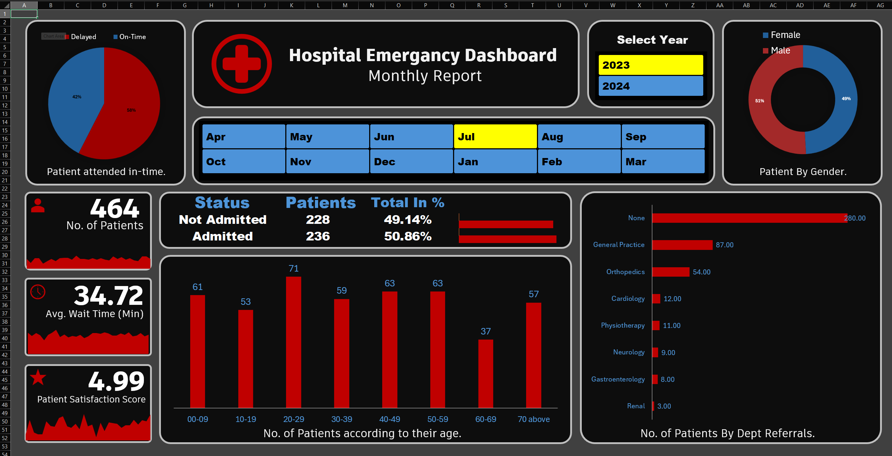
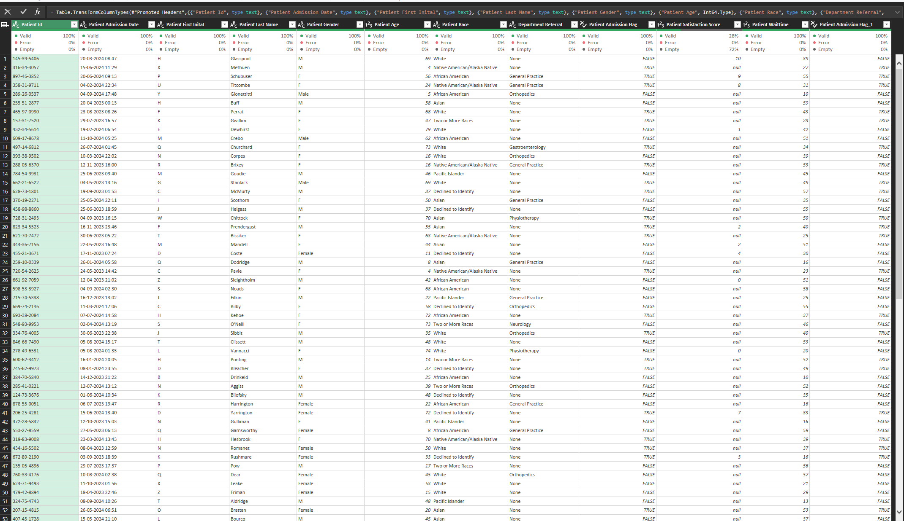
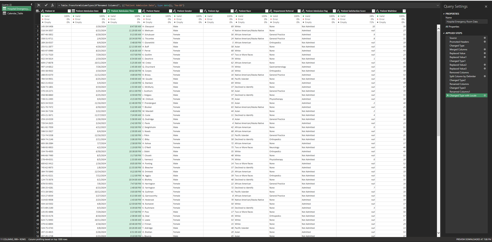
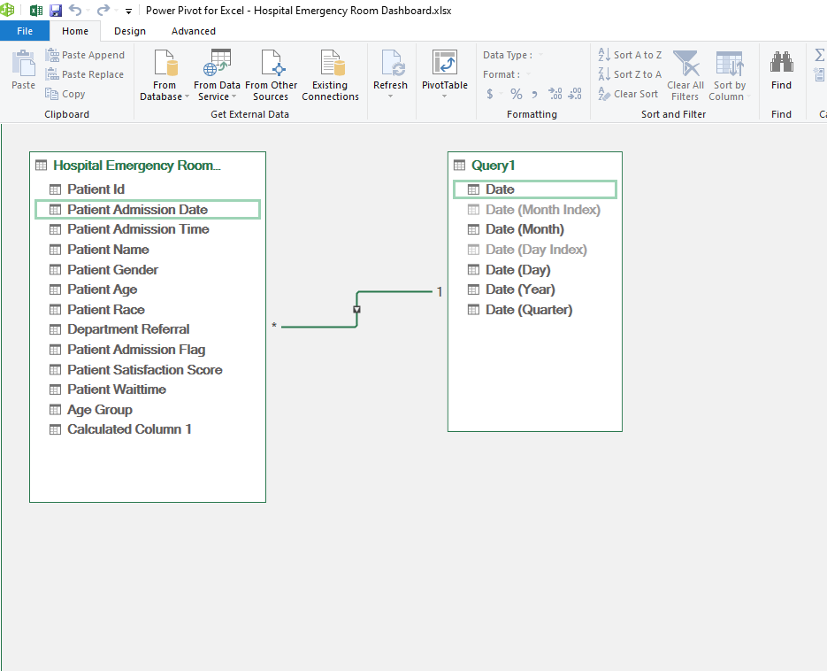
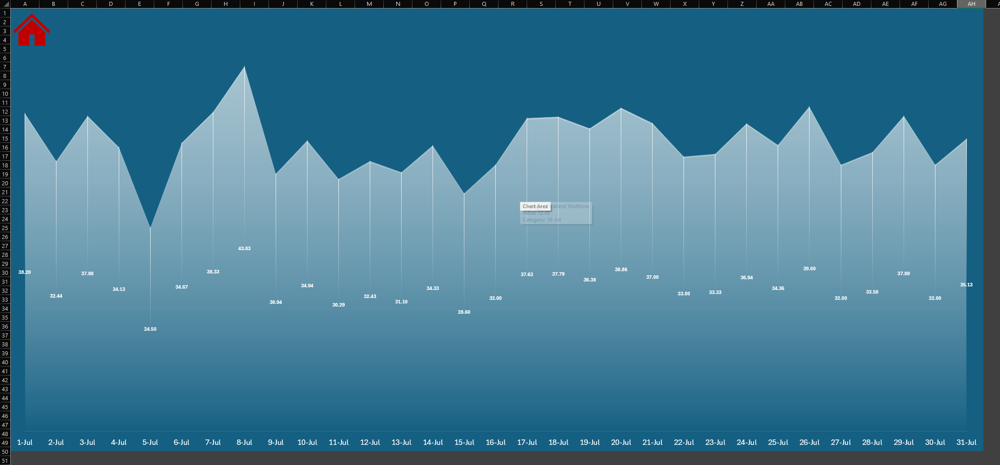

# 🏥 Hospital Emergency Room Dashboard

An interactive Excel dashboard analyzing hospital emergency room data — built end-to-end using **Power Query**, **Power Pivot (DAX)**, and **PivotCharts**, covering the full analytics workflow from raw data to a decision-ready report.



---

## 📌 Project Overview

This project simulates a real-world hospital emergency department reporting need: tracking patient volume, wait times, admissions, satisfaction, and department referrals — with dynamic filtering by year and month.

**Goal:** Turn messy, inconsistent raw admission data into a clean, modeled, and fully interactive dashboard that supports monthly operational reporting.

---

## 🔧 Tools & Skills Used

| Stage | Tool | Skills |
|---|---|---|
| Data Cleaning | Power Query | Data type conversion, locale fixes, column splitting, replacing values, removing duplicates/errors |
| Data Modeling | Power Pivot | Relational modeling, Calendar table, table relationships |
| Calculations | DAX | Measures for admission %, averages, time intelligence |
| Visualization | PivotTables & PivotCharts | KPI cards, donut/pie charts, bar charts, drill-down interactivity |
| Interactivity | Slicers & Timelines | Year/month filtering, click-to-drill navigation |

---

## 🧹 Step 1: Data Cleaning (Power Query)

The raw dataset had inconsistent date formats, locale mismatches, unstructured names, and mixed data types. Power Query was used to clean and reshape the data into an analysis-ready table.

**Before Cleaning:**


**After Cleaning:**


**Key cleaning steps included:**
- Fixing a **locale mismatch** in date columns (resolved via `Changed Type with Locale`)
- Splitting `Patient Name` into First Initial / Last Name
- Standardizing `Patient Admission Flag` (Text → Boolean)
- Removing unnecessary columns and renaming headers for clarity
- Handling nulls in `Department Referral` and `Patient Satisfaction Score`

---

## 🧩 Step 2: Data Modeling (Power Pivot)

A relational data model was built connecting the cleaned patient table to a dedicated **Calendar table**, enabling time-based analysis (Month, Quarter, Year) throughout the dashboard.



- One-to-many relationship: `Calendar_Table[Date]` → `Hospital Emergency Room Data[Patient Admission Date]`
- Enabled Month/Quarter/Year slicers and time-intelligence-ready measures

---

## 📊 Step 3: Dashboard & Visualization

The final dashboard (shown above) includes:

- **KPI Cards:** Total patients, average wait time, patient satisfaction score
- **Admission Status:** Admitted vs. Not Admitted with % breakdown
- **Demographics:** Gender distribution (donut chart), age group breakdown (bar chart)
- **Department Referrals:** Horizontal bar chart ranking referral volume by department
- **On-Time Performance:** Delayed vs. On-Time patient attendance (pie chart)
- **Year & Month Filters:** Interactive slicers for 2023/2024 and all 12 months

---

## 🔍 Bonus: Drill-Down Interactivity

Clicking on any of the area charts on the main dashboard navigates to a **day-wise breakdown** of average patient wait time for that month — built using a combination of PivotCharts and a "Back to Home" navigation button.



---

## 📁 Repository Structure

```
hospital-er-dashboard/
├── README.md
├── images/                  # Dashboard screenshots used in this README
├── data/
│   ├── raw/                 # Sample/dummy raw data (pre-cleaning)
│   └── cleaned/             # Sample/dummy cleaned data (post-Power Query)
└── excel/
    └── Hospital_Emergency_Dashboard.xlsx   # Full workbook (Power Query + Power Pivot + Dashboard)
```

> **Note:** Data used in this project is anonymized/synthetic and created for learning purposes only. No real patient information is included.

---

## 🚀 What I Learned

- Structuring a full Power Query ETL pipeline to handle real-world messy data
- Building a proper star-schema-style data model in Power Pivot rather than relying on flat tables
- Writing DAX measures for dynamic KPI calculations
- Designing a dashboard with drill-down interactivity for deeper analysis
- Thinking like an analyst: what questions would a hospital administrator actually want answered?

---

## 📬 Contact

If you'd like to discuss this project or see a live walkthrough, feel free to connect with me on [LinkedIn](#) or reach out directly.
